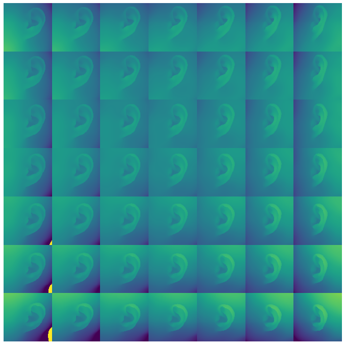
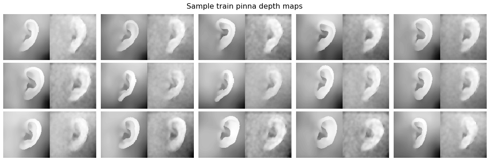

# Introduction {#intro}
[//]: # (motivations)
Virtual reality (VR) and augmented reality (AR) research has made substantial progress over the last decades, and virtual environments created using binaural sound rendering technologies find applications in a wide array of areas, such as aids for the visually impaired, tools for audio professionals, and VR-based entertainment systems.

[//]: # (key concepts)
These techniques are based on the application of a particular filter called _head-related transfer function_ (HRTF), which colors a sound according to its location in the virtual environment.
However, HRTFs derived from standard anthropometric pinnae, such as those in dummy heads, often results in localization errors and wrong spatial perception [@moller_binaural_1996].
In fact, while generic HRTFs may successfully approximate the interaural time difference (ITD) and interaural level difference (ILD) cues which are used to perceive the horizontal direction of a sound source, the monaural cues needed to discern its vertical direction are highly dependent on the anthropometric characteristics of each ear.

In order to provide the most realistic and immersive experience possible, it is necessary for users to have their custom set of HRTFs measured, which can prove quite impractical due to the need for dedicated facilities and the overall invasiveness of the procedure.
Recently, attempts have been performed at synthesizing or customizing HRTFs using various data from users such as anthropometric measurements, 3D scans, or perceptual feedback.

[//]: # (research question, roadmap)
This paper investigates methods for generating individualized HRTFs, in particular using newly-developed deep learning algorithms, and further expands on the topic by documenting the replication attempts and experiments conducted as part of the research.
In the next section, the most recent contributions to the field are introduced.
Section \ref{methods} details the computational techniques used in selected works from the literature as well as in the research carried out as part of the seminar, with particular focus on deep learning methods.
In Section \ref{results}, the applications and outcomes of the aforementioned techniques for replications and other experiments are discussed, with the purpose of assessing their effectiveness. 
Finally, closing remarks as well as pointers for future research are stated in Section \ref{end}.

# State of the art {#sota}
Over the past decades, several strategies have been devised, in order to avoid the burden of conducting strenuous acoustical measurements with human subjects.
In a recent review, Guezenoc [@guezenoc_hrtf_2018] divides such alternative approaches into _numerical simulation_, _anthropometrics_-based, and _perceptual feedback_-based.

The former method consists in simulating the propagation of acoustic waves around the subject, using 3D scans; the most common simulation schemes include Fast-Multipole-accelerated Boundary Element Method (FM-BEM) [@gumerov_fast_2007] and Finite Difference Time Domain (FDTD) [@mokhtari_comparison_2007] for frequency and time domain respectively.

With the help of databases of publicly available HRTFs and machine learning techniques, anthropometric measurements can be used to choose, adapt, or estimate a subject's HRTF set.
In 2010, Zeng [@zeng_hybrid_2010] implements an hybrid model based on principal component analysis (PCA) and multiple linear regression, which uses anthropometric parameters to select the most suitable HRTF set for the given user.
Similarly, user feedback on perceptual tests can be used to inform regression models for tasks such as those listed above.

![Overview of the algorithm from [@yamamoto_fully_2017] during training and usage phases.\label{yama2017}](img/yamamoto2017.png){scale=0.5}

In more recent times, there has been an interest in solving these tasks using deep learning techniques.
In 2017, Yao [@yao_head-related_2017] uses anthropometric measurements to select the most suitable HRTF sets from a larger database.
In 2018, Lee [@lee_personalized_2018] develops a double-branched neural network that processes anthropometric data with a multi-layer perceptron and edge-detected pictures of the ear with convolutional layers, combining the outputs of the two into a third network to estimate HRTF sets.
Again in 2017, Yamamoto [@yamamoto_fully_2017] trains a variational autoencoder on HRTF data, and devises a perceptual calibration procedure --- illustrated in Fig. \ref{yama2017} --- to fine-tune the latent variable used as input by the generative part of the model.
Finally, in 2019, Chen et al. [@chen_autoencoding_2019] train an autoencoder to reconstruct HRTFs along the horizontal plane, and subsequently uses the resulting latent representations as targets for a multilayer perceptron which feeds on anthropometric data and azimuth angle, allowing users to synthesize new HRTFs using the MLP and decoder --- this is shown in Fig. \ref{chen2019}.

# Methods {#methods}
This section presents some of the most relevant computational methods found in the relevant literature on HRTF individualization.
The aspects covered in the following subsections include the encoding of generated HRTFs, the extraction and choice of viable predictors, and the deep neural network architectures adopted.

## HRTF representation {#repr}
A single HRTF is defined as the the far-field frequency response of a given ear, measured from a point in the free field to a point in the ear canal [@cheng_introduction_2001].
An HRTF set is composed of the HRTFs of both left and right ears, measured at a fixed radius from the head, and across several elevations and azimuths.
According to Kulkarni et al. [@kulkarni_minimum-phase_1995], HRTFs specified as minimum-phase FIR filters have been empirically proved to be perceptually acceptable. 
Thus, HRTFs can be stripped of the ITD information and stored as real-valued log-magnitude response.

![Data structure, called _HRTF patch_, used [@yamamoto_fully_2017] as input to the autoencoder.\label{hrtf_patch}](img/hrtf_patch.png){scale=0.5}

While this is the preferred way of storing, exchanging, and using HRTF sets, neural networks have different requirements that call for ad-hoc formats.
In particular, Yamamoto [@yamamoto_fully_2017] uses different representations for the input and output of his autoencoder.
The input data format, which is dubbed _HRTF patch_, consists of a 4-dimensional tensor of shape $(5 \times 5 \times 128 \times 4)$. 
The first two dimension describe the HRTF under investigation and its neighbors along the elevation and azimuth directions, for a total of 25 HRTFs in each given patch.
The remaining ones describe the content of each HRTF in the patch: the last dimension, also called _channel_, encodes frequency power spectrum or time-domain signal for either left or right ear, where 128 is their length.
This data representation provides a substantial amount of contextual information, which can be learnt by 3D-convolutional layers.
The structure of the HRTF patch can be seen in Fig. \ref{hrtf_patch}.

The output of the autoencoder does not contain any neighbor HRTF, but instead of encoding the frequency power spectrum or time-domain information as a continuous signals, it uses a quantized format where each sample can have one of 256 possible discrete values that are then mapped to another dimension using one-hot encoding.
The continuos signals can be reconstructed by taking the index of the value with highest magnitude and passing it to a µ-law algorithm.
This strategy --- which can be found in certain WaveNet implementations [@oord_wavenet:_2016] --- makes sure to retain some of the high-frequency details of the continuous signals, which are often lost when reconstructing data with  autoencoders.

Further formats which have been investigated include mappings where HRTFs sharing the same azimuth or elevation are combined in a 2-dimensional image-like representation with either elevation or azimuth along one axis and frequency along the other; the color of each pixel would then represent the log-magnitude of the spectrum.
The structure expressed by adjacent HRTFs could therefore be learnt using 2D-convolutional layers.
However, the downside of combining data in this way is the reduction of available data points to use for training.

Finally, a compact representation for individual HRTFs has been proposed, consisting of the first $N$ principal components of the HRTF.
While it has been observed that as little as 20 components are enough to reconstruct the original HRTF with maximum 1.6 dB of spectral distortion (see Fig. \ref{eardnnhrtf_res}, left side), the loadings of the PCA must be learned, and become an essential part of the representation.

## User data extraction {#anthr}
A fundamental aspect of HRTF individualization is the kind of data used to personalize the frequency response.
Most often, acquiring data about a subject is faster and less strenuous than collecting an entire HRTF set, as well as having looser requirements in terms of external conditions and tools.
The kind of data that can be collected comprises anthropometric measurements, complex anthropometric data, and perceptual feedback.

![Anthropometric measurements as listed on the CIPIC dataset [@algazi_cipic_2001].\label{anthro}](img/anthro.png){scale=0.5}

The CIPIC dataset [@algazi_cipic_2001] released in 2001 sets a convention for anthropometric data collection and reporting, which has been adopted by later datasets too [@fabian_hutubs_2019].
Its format specifies 17 anthropometric parameters for head and torso, and 10 for the pinna, which can be seen in Fig. \ref{anthro}.
It has the disadvantage of having loosely defined measurement points, which translate into systematic biases which makes merging different datasets particularly prone to errors.
Moreover, anthropometric features are only unique to each given subject and as such, may not have enough predictive power to be used for the regression of several HRTFs per subject.
Spagnol et al. address this shortcoming by introducing elevation-dependent anthropometric measurements as predictors [@spagnol_frequency_2015], based on the lengths of segments spanning from the tragus to each of the three contours outlined by the helix and concha, and oriented according to a given elevation angle.

Another source of useful predictors for regression tasks can be found in 3-dimensional representation of the subjects' pinnae and head.
Recent HRTF datasets include digital scans of the heads and pinnae [@fabian_hutubs_2019] [@spagnol_viking_2019] stored as 3D models, which can be used for feature extraction. 
In particular, 2-dimensional projections such as digital renderings or depth maps can be conveniently processed in neural networks using convolutional and pooling layers.
As mentioned in the following sections, convolutional autoencoders can extract salient features from images of the pinna, which can then be used as predictors.

Finally, perceptual feedback can be useful when collecting manual measurements or when information-rich user data is not viable. 
Furthermore, this kind of data is more resilient to systematic errors and biases introduced by measurement procedures [@guezenoc_hrtf_2018].
Perceptual feedback often consists in letting a user evaluate and rate the performance of a given HRTF set, and is most commonly adopted in HRTF selection or adaptation tasks.
Nevertheless, Yamamoto uses perceptual feedback to navigate the latent space in order to synthesize suitable HRTFs for a given user [@yamamoto_fully_2017]. 
It is worth noting how, while validating models based on anthropometric data is quite trivial, models using perceptual data requires a user study or the implementation of a virtual agent. 

## Autoencoder {#ae}
Most conventional neural networks are used to predict a target $y$ from an input $x$, a task known as supervised learning.
On the other hand, autoencoders learn a compressed representation $z$ of the input data $x$ called _latent representation_, which is then used to generate a reconstructed version $\hat{x}$.
Thus, the purpose of autoencoders is to extract useful features from the input data in an unsupervised manner [@goodfellow_deep_2016].
One such example can be seen in Fig. \ref{chen2019}, where an autoencoder is used to derive a compact representation from HRTFs, which can then be used as the target of a prediction task [@chen_autoencoding_2019].

![Architecture proposed by [@chen_autoencoding_2019], with HRTF autoencoder and deep neural network for latent representation estimation from anthropometry; solid arrows indicate training process, dotted arrows indicate usage.\label{chen2019}](img/chen2019.png){scale=0.5}

Autoencoders usually consists of a feed-forward neural network, in turn composed of two sub-nets: an encoder network $f()$ and a decoder network $g()$ such that $g(f(x)) = g(z) = \hat{x}$.
Training an autoencoder usually involves iteratively updating the weights and biases of the two networks through backpropagation, in order to minimize a cost function representing the mean squared error (MSE) between $x$ and $\hat{x}$.

Over time, several variants of the autoencoder have been developed.
Each variant extends the conventional autoencoder architecture by promoting different properties of the latent space, thereby catering to different tasks such as denoising, classification, or --- as it is this case here --- generative applications. 
Two common generative models based on the autoencoder are described below.

\ 

### Variational autoencoder (VAE) {#vae}
Variational autoencoders are a class of generative models.
A VAE is a probabilistic model where the encoder $q_{\theta}(z|x)$ maps the probability distribution a certain latent representation given a data point, and the decoder $p_{\phi}(x|z)$ outputs the probability distribution of the data, given a point in the latent space.
In VAEs, it is often desireable to model the latent space as an isotropic multivariate Gaussian distribution.
This constraint is enforced by introducing a measure of distance between the aforementioned prior distribution $p_{\theta}(z) \sim \mathcal{N} (0,1)$ and the encoder distribution, called Kullback-Leibler divergence.
This probabilistic framework proves useful when synthesizing HRTFs, because it can learn causal factors of variations in the data [@kingma_introduction_2019].
However, there exists no way of generating a a data point with specific characteristics, such as the HRTF at a given azimuth and elevation angles. 
While the points in latent space are likely to generate plausible new data, one can only obtain random instances.
The class of autoencoders described below aims at addressing this shortcoming.

\ 

### Conditional variational autoencoder (CVAE) {#cvae}
CVAEs are an extension of variational autoencoders, where an input data labels $c$ modulate the prior distribution of the latent variables that generate the output [@sohn_learning_2015].
Thus, the encoder is formulated as $q_{\theta}(z|x,c)$, meaning that the encoding process is conditioned by an attribute $c$, instead of the data content alone.
Furthermore, the decoder too is conditioned by the label, so that it models $p_{\phi}(x|z,c)$.
The influence of the label $c$ is incorporated into the VAE structure by means of concatenating its value to the input data $x$ before feeding it into the encoder, as well as to the latent variables $z$ before feeding them into the decoder.
Yamamoto [@yamamoto_fully_2017] uses a customized deep CVAE, where labels consisting of a subject's ID and a spatial orientation, both provided as one-hot encoded vectors, are used to condition each layer of encoder and decoder.

# Results {#results}
The research conducted as part of this work can be grouped into three main areas, which are related to feature extraction to use as predictors, unsupervised learning of HRTF data based on the deep autoencoder network, and synthesis of HRTFs from anthropometric data using deep multilayer perceptrons and principal component analysis, inspired by the work of Chen et al. [@chen_autoencoding_2019].
The following subsections elaborate on the aforementioned topics.

## Autoencoding ear images {#vae-ear}
[//]: # (intro)
The shortcomings of anthropometric measurements mentioned in Section \ref{anthr}, together with with their limited predictive power highlighted by a previous work [@miccini_estimation_2019], prompted the exploration of alternative features to be used in HRTF prediction tasks.
In the literature, features from pinna images have been extracted using convolutional neural networks, for the purpose of biometrics-based identification [@bansal_convolutional_2019].
Thus, it was thought to employ convolutional layers in a variational autoencoder in order to derive salient features from its compact representation in an unsupervised manner.

[//]: # (depthmaps extraction)
Digital renderings of the z-buffer (also known as depth maps) of the 3D models in the HUTUBS dataset [@fabian_hutubs_2019] have been extracted, using the `pyrender` and `trimesh` packages for Python, and converted into 8-bit grayscale images.
For each of the 55 unique head meshes, the point of view has been placed on either side of the head, so as to show each pinna separately.

[//]: # (processing and augmentation)
In order to increase the amount of images used for training, several data augmentation techniques have been adopted.
Firstly, variations of the point of view have been introduced, by tilting the camera along both elevation and azimuth.
Secondly, slight vertical and horizontal offsets have also been introduced.
Lastly, each of the images thus generated has been duplicated and processed with sparse, discrete noise.
A tool for selecting subsets based on the augmentation parameters, has been developed, allowing the size of the dataset used for training to be anywhere from a few to well over a million picturess.
Fig. \ref{depthmap_vars} shows the azimuth and elevation variations for a given subjects.

{scale=0.5}

[//]: # (network variations)
The model used in this experiment is a convolutional variational autoencoder.
This architecture is similar to the one described in Section \ref{vae}, except it uses 2D-convolutional layers.
In the encoder, several dimensionality reduction techniques have been tested, such as _max pooling_ layers or _strides_ in the convolutional kernels, with no discernible difference in performances.
Similarly, the decoder part has been originally implemented using transpose convolution with strides, which caused noticeable artifacts in the output images.
In order to address this, a combination of _upsampling_ layers and regular convolution has instead been used [@odena2016deconvolution].
The hyperparameters of the architecture included the number of stacked layers, the number of convolutional filters for each layer, the number of latent dimensions, and batch normalization.

[//]: # (evaluation criteria)
Multiple experiments have been conducted, using different combinations of input data and model hyperparameters.
The main criterion for evaluating the model effectiveness is the quality of the reconstruction.
Indeed, images that have been faithfully reconstructed are indicative of a meaningful compact representation that can effectively encode the characteristics of the pinnae; conversely, ear pictures that fail to be distinguishable from those from different subjects are not satisfactory.
Furthermore, it is expected that latent variables show some degree of correlation with the anthropometric measurements related to the pinna, since they also describe factors of variance within different pinnae.

{scale=0.5}

[//]: # (remarks)
The experiments have shown how, while the elevation and azimuth dependent data augmentations expose or hide different parts of the pinnae thereby affecting their appearance, most of the variance in the data occurs in the surrounding area of the head, with is of no interest.
This resulted in latent variables encoding mostly features related to the gradient in the background areas, while pinnae appear blurry and undistinguishable.
Using data rendered from the same point of view and only augmenting the data using noise seems to alleviate the problem, as seen in the reconstruction in Fig. \ref{depthmap_rec}.
However, the decrease in available training data negatively affects generalization, causing severe artifacts when sampling the latent space.
Furthermore, the compact representation of the data points exhibited little to no correlation with the anthropometric measurements.

## Autoencoding HRTFs {#vae-hrtf}
[//]: # (intro)
Synthesizing HRTFs from a set of parameters is a fundamental aspect of the individualization task.
Since it is not yet fully understood what these parameters could be, it might be interesting to let a neural network derive its own by means of autoencoding the HRTFs.
These parameters can then be the target of another prediction task [@chen_autoencoding_2019] or adjusted through perceptual feedback from the user [@yamamoto_fully_2017].
Therefore, several VAE models have been developed and trained, using different data layouts and architectures.

[//]: # (network variations)
The architecture of the networks employed in this series of experiments is heavily dependant on the data formats, which are described in Section \ref{repr}.
In particular, given different dimensionalities, the following has been tested: 

- 3D: HRTF patch, processed using 3D-convolutional layers; only the middle HRTF is reconstructed
- 2D: group of HRTFs ($\text{elevation} \times \text{frequency}$, $\text{azimuth} \times \text{frequency}$) or HRTF bins ($\text{elevation} \times \text{azimuth}$), processed using 2D-convolutional layers 
- 1D: single HRTF, processed using either dense or 1D-convolutional layers

In the first case, the reconstruction target of the autoencoder is similar to the one-hot encoded output representation used by Yamamoto.
In the last case, a layer topology reminiscent of _ResNet_ [@he_deep_2015] has been also tested.
This variant allows for deeper networks that do not suffer from vanishing gradient during training.
For each scenario, a different number of convolutional filters, convolutional layers, and latent dimensions, has been tried.

[//]: # (evaluation criteria)
Just as for the pinna images case, the main goals here are a satisfactory reconstruction of the input and a meaningful latent space mapping.
While the former can be assessed using quantitative metrics such as the _spectral distortion_ (SD) between true and reconstructed HRTF, the latter is a more elusive property which can be inferred from the correlation with known HRTF predictors such as certain pinna anthropometric data, or azimuth and elevation angles.

{scale=0.5}

[//]: # (remarks)
The experiments conducted so far show poor reconstruction performances and little correlation with the aforementioned variables, highlighting the need for more sophisticated models or more effective data representations.
Indeed, reconstructed 2D and 1D representations appear blurry and lacking sharpness on the distinctive notches and peaks of the HRTFs.
Similarly, the one-hot output encoding used in the 3D experiments results in mostly erratic behavior, most likely because without the gaussian distribution constructed along the quantized levels dimension [@yamamoto_fully_2017], the reconstruction task proves too difficult.
More promising are the 1D experiments using deep residual layers --- they can be observed in Fig. \ref{vae_hrtf_rec} --- which may suggest that a deeper network and a larger dataset are more beneficial to the training process than contextual data.
However, the average SD on the test set is as high as 5.2 dB.

## Predicting principal components {#dnn-pca}
[//]: # (intro)
This last set of experiments is based on the notion that autoencoders perform a similar task as PCA, while also learning non-linear feature spaces [@luo_virtual_2013].
However, it has been experimentally shown that, with as little as 20 principal components, is it possible to reconstruct the HRTFs with an average spectral distortion of 1.7 dB --- see Fig. \ref{eardnnhrtf_res} (left).
Moreover, some of these principal components show a high degree of correlation with elevation and azimuth angles.
The models developed and evaluated here are therefore aimed at predicting these principal components from user data, and are inspired by the work of Chen et al. [@chen_autoencoding_2019].

[//]: # (network variations)
The type of data used by the models as predictors are either anthropometric measurements or data derived from the pinna depth maps used in \ref{vae-ear}, as well as elevation and azimuth angles.
In the latter case, PCA has been performed on the pixels of the depth maps, and the first few principal components were used as input variables.
Due to the nature of the input and output data, only architectures with dense layers have been tested.
The main hyperparameters were: number of HRTF principal components, number of depth maps principal components, and number and size of hidden layers. 

[//]: # (evaluation criteria, remarks)
The setup used for these experiments implement a potential complete HRTF individualization procedure, where user data is fed as input, a deep neural network derives HRTF principal components, and the PCA loadings learned from a training set are used to derive a new HRTF.
Thus, the entire system has been embedded in a 10-fold validation routine where, at each iteration, a train set comprising $\frac{9}{10}$ of the data was used to fit the neural network and calculate the PCA loadings, whereas a smaller test set with the remaining $\frac{1}{10}$ was used for validation.
The metric observed throughout the process is the spectral distortion of the HRTF, calculated between 3 and 16 kHz.

{scale=0.5}

[//]: # (remarks)
The results of using only anthropometric measurements --- along with elevation and azimuth angles --- as predictors is an average SD of 4.5 dB and 4.7 dB for training and test sets respectively.
While this is indeed promising, upon close inspection most generated HRTFs look similar, and while the general trend of the spectrum is correct, the sharp spectral features are not clearly distinguishable.
When trying to derive principal components from the pinna depth maps, a large number of principal components proves necessary for a satisfactory reconstruction, and reconstruction of the data in the test set is always poor.
Thus, the features obtained from the principal components fail at generalizing the characteristics of the pinna, and result in poorer performances with more severe overfitting.
A model combining both predictors has also been tested, peaking at 4.1 dB and 4.7 dB of SD for training and test sets respectively, as shown in Fig. \ref{eardnnhrtf_res} (right).

# Conclusions {#end}
[//]: # (synthesis)
This paper presented some of the most promising advances in HRTF individualization, introduced the deep learning technologies associated with them, and detailed the results of the replication efforts, as well as further experiments based on the underlying knowledge base.

[//]: # (limitations)
While none of the three domains of investigation has shown outstanding results, the knowledge acquired throughout the development and troubleshooting phases highlighted areas of improvement which can pave the way to further --- and ideally more successful --- research.
No major difference with network size or hyperparameter tuning has been observed, although several setups proved more effective than others.
In particular, providing larger amount of data during the training process and positively affects generalization, and so do deeper networks with batch normalization layers.

[//]: # (outline)
There exist several possible improvements for each of the three fields. 
Autoencoding pinna images could benefit from more sophisticated models such as those using _ResNet_ or _Inception_ convolutional layers.
Autoencoding HRTFs may prove more useful when performed with a conditional autoencoder, where elevation and azimuth directions are fed either as two scalars or as one-hot encoded vectors.
Moreover, in order to improve the sharpness of the most salient HRTF spectral features, the probabilistic one-hot encoding output representation introduced by Yamamoto [@yamamoto_fully_2017] could be adopted.
Finally, all deep models presented above would certainly benefit from having access to larger datasets with more subjects.
This may be addressed by merging multiple datasets, which would require a normalization step to ensure that biases --- such as those caused by different measurement setups --- are not introduced into the learning process.

It is also worth noting how SD alone is not a solid measure of perceptual fitness, and user tests in a virtual environment might be necessary to reliably assess the performances of generated HRTF sets.

# Bibliography {#biblio}
